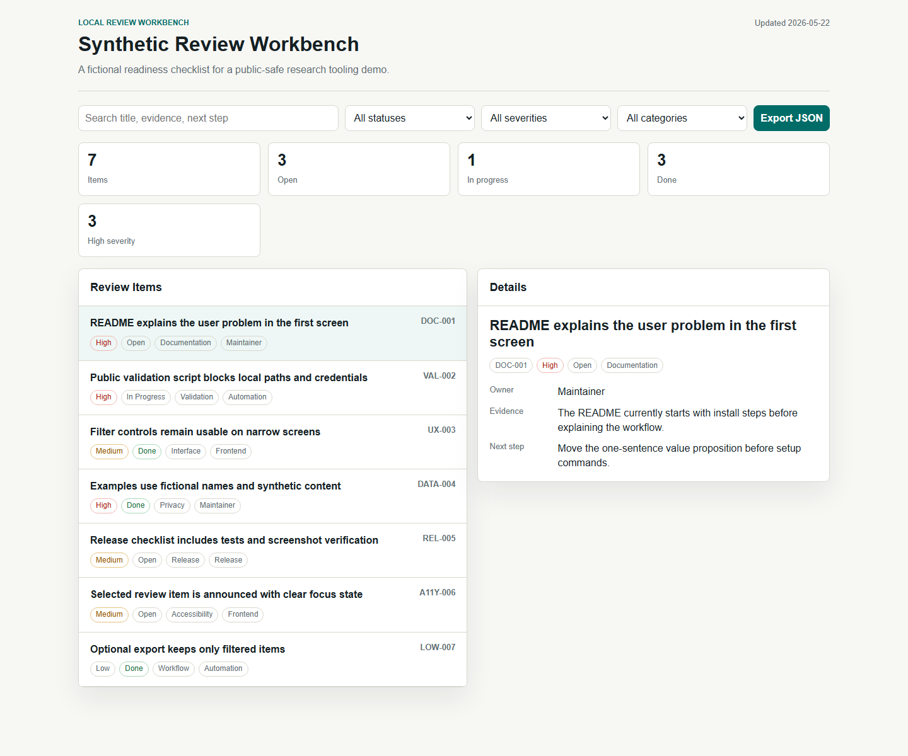

# HTML Review Workbench Template

A dependency-free single-page HTML workbench for turning review checklists into a searchable, filterable, shareable local dashboard.

It is useful for paper reviews, project audits, design reviews, document checks, and release readiness reviews when a plain Markdown checklist becomes hard to scan.



## What It Does

- Opens directly from `index.html`.
- Reads a generated JavaScript data file from a JSON source of truth.
- Filters by status, severity, category, and free-text search.
- Shows status counts and focused item details.
- Exports the currently filtered items as JSON.
- Works without a backend, account, database, tracking script, or build system.

## Quick Start

```powershell
python scripts\build_data_js.py
python scripts\validate_public_assets.py
```

Open `index.html` in a browser.

## Customize The Data

Edit:

```text
data/sample-review.json
```

Then regenerate:

```powershell
python scripts\build_data_js.py
```

## Public-Safe Boundary

The example data is fictional. It does not represent a real manuscript review, thesis review, company audit, job search tracker, customer deliverable, or private project checklist.

Do not publish private comments, reviewer notes, collaborator names, company materials, local file paths, credentials, or personal data.

## Suggested GitHub Topics

```text
html
dashboard
review
checklist
template
productivity
local-first
javascript
research-tools
static-site
```
